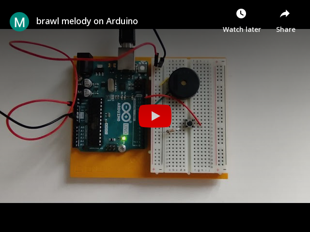
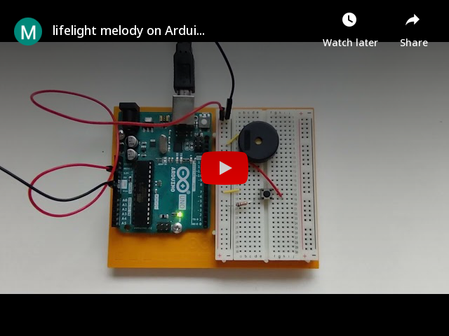

# Melody-On-Arduino
I created these two music melodies based on the transcriptions given in the .ino files, which can run on Arduino with a piezo. With slight modification, you can also run with a stepper motor.

## Demo

- brawl_smashBros.ino:

- lifelight.ino:

